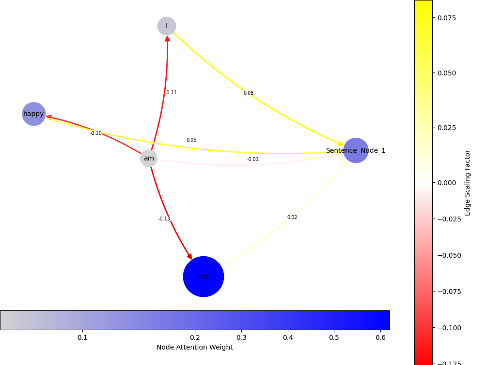

# Semantic Propagation GNN - Bias Free Sentiment Analysis

This repository houses the code along with detailed comments, used to generate the results for the "Bias Free Sentiment Analysis" paper. It proposes a new GNN architecture designed to propagate word-level emotion information throughout sentence syntactic graphs.

## File Structure
1. `data/` - Contains the dataset files.
2. `custom_gnn/` - Contains the custom GNN layers implementation.
3. 'polish', 'english', 'discrete' - Contains the code for the three different experiments.
4. 'english_explainable' - Contains the explainability code for the English experiment.
5. 'plots' - Contains the generated plots
6. 'training_word_emotion' - code for training word-level norm extrapolation models  

The models generated with this code are available at:
https://drive.google.com/drive/folders/1siJGWwUJjWdI9P1Qhhj6UuwRYUKGkApV?usp=sharing

The  repository will be further refined in the upcoming weeks.
